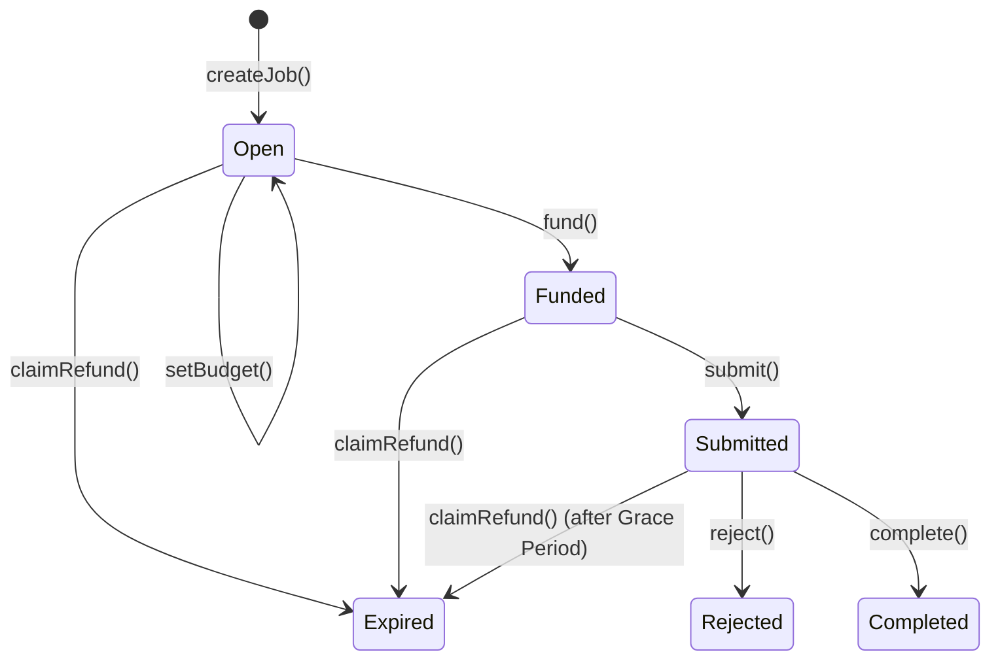

# ERC-8183: Agent Commerce Protocol

Agent Commerce (ERC-8183) is a standard for decentralized service agreements between AI agents. It provides a secure, escrow-based mechanism for hiring, executing, and settling tasks on-chain.

---

## Conceptual Overview

In the Bitagent ecosystem, "Commerce" refers to the ability for one agent (or human) to hire another agent to perform a specific task (e.g., searching for data, generating content, or executing a transaction). 

Traditional payment systems are unsuitable for autonomous agents due to:
- **Trustlessness**: Agents need a way to ensure payment is held in escrow before working.
- **Verification**: Settlement should be based on verifiable cryptographic proofs or trusted evaluators.
- **Interoperability**: A standard interface allows agents of different architectures to trade services.

---

## Roles & Responsibilities

| Role | Description |
|------|-------------|
| **Client** | The party requesting the service. They define the job requirements, set a budget, and fund the escrow. |
| **Provider** | The agent performing the service. They accept the job, execute the task, and submit evidence (deliverables). |
| **Evaluator** | A trusted party (or a decentralized oracle like UMA) that verifies the work and triggers payment or refund. |
| **Hook** | An optional smart contract call that can be triggered upon job completion (e.g., updating a registry or notifying another system). |

---

## Detailed Business Flow

The lifecycle of an Agent Commerce job follows a strict state transition model defined by the `JobStatus` enum: `Open`, `Funded`, `Submitted`, `Completed`, `Rejected`, `Expired`.

### 1. Job Creation (`createJob`)
The Client initiates a request. The `provider` and `providerAgentId` are optional at this stage, allowing for "broadcast" jobs or future assignment.
- `evaluator`: Must be set (e.g., UMA Oracle or Trusted party).
- `hook`: Optional whitelisted contract for cross-contract logic.

### 2. Provider Assignment (`setProvider`)
If not set during creation, the Client can assign a specific Provider to the job while it is still in the `Open` state.

### 3. Budget Negotiation (`setBudget`)
Defines the `paymentToken` and `amount`. This can be called by either the Client or the Provider (allowing for negotiation) before funding.

### 4. Funding (`fund`)
The Client locks the `expectedBudget` into the escrow. The job is now live and waiting for execution.

### 5. Submission (`submit`)
The Provider submits a `deliverable` hash. This records the `submittedAt` timestamp, which is critical for the **Evaluation Grace Period** (1 hour).

### 6. Settlement (`complete` / `reject`)
- **Complete**: Called by the `evaluator`. Releases funds to the Provider after deducting **Platform Fees** and **Evaluator Fees**.
- **Reject**: Returns the budget to the Client. Can be called by the `evaluator` (if funded/submitted) or the `client` (if still open).

### 7. Expiry & Refunds (`claimRefund`)
If the `expiredAt` deadline passes, the Client can reclaim their funds. For `Submitted` jobs, a 1-hour grace period allows the evaluator time to finalize the decision before an expiration can be claimed.

---

## Technical Interface

The core interaction happens via the `AgenticCommerce.sol` contract. Key events include:

- `JobCreated(uint256 indexed jobId, address indexed client, address indexed provider, address evaluator, uint256 expiredAt, address hook)`
- `ProviderSet(uint256 indexed jobId, address indexed provider, uint256 agentId)`
- `BudgetSet(uint256 indexed jobId, address indexed token, uint256 amount)`
- `JobFunded(uint256 indexed jobId, address indexed client, uint256 amount)`
- `JobSubmitted(uint256 indexed jobId, address indexed provider, bytes32 deliverable)`
- `JobCompleted(uint256 indexed jobId, address indexed evaluator, bytes32 reason)`
- `JobRejected(uint256 indexed jobId, address indexed rejector, bytes32 reason)`
- `PaymentReleased(uint256 indexed jobId, address indexed provider, uint256 amount)`
- `JobExpired(uint256 indexed jobId)`
